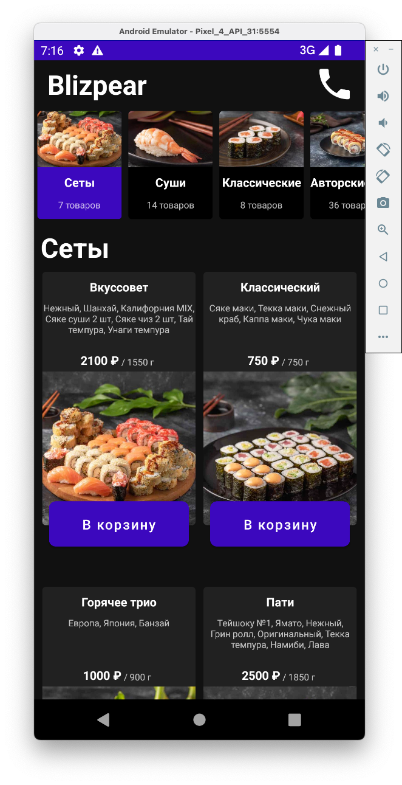
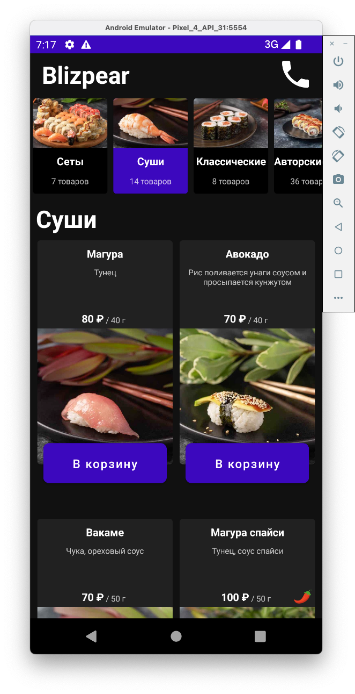

<h2> Тестовое задание для "NTI.team" </h2>

<h2>Apk находится в папке additional_data/apk/</h2>

<b>Примеры экранов:</b>

  

<b>Используемые технологии:</b>
- MVVM + States
- Kotlin coroutines
- Retrofit, Moshi
- Glide
- Koin
- Cicerone